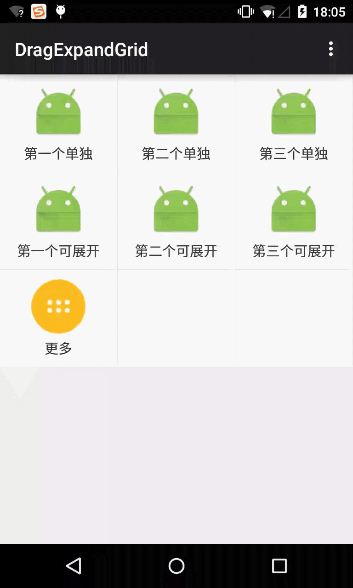

# DragExpandGrid

这是一个多功能的扩展GridView

1. 可展开，可拖动，可排序，可删除。
2. 固定更多按钮。
3. 展开合并支持动画。
4. 支持箭头图标移动。

数据的处理和显示使用Bean。

来自于[500彩票Andorid客户端](http://500.com )首页功能。

# Preview

数据的处理放在了CustomGroup中，见代码！！

#Usage

activity_main.xml中有示例用法

    <com.wedcel.dragexpandgrid.view.CustomGroup
        android:layout_width="fill_parent"
        android:layout_height="wrap_content"
        />

#Other

欢迎访问我的博客：[http://wedcel.com](http://wedcel.com)

#License

Copyright 2015  Wedcel.

Licensed to the Apache Software Foundation (ASF) under one or more contributor license agreements. See the NOTICE file distributed with this work for additional information regarding copyright ownership. The ASF licenses this file to you under the Apache License, Version 2.0 (the "License"); you may not use this file except in compliance with the License. You may obtain a copy of the License at

[http://www.apache.org/licenses/LICENSE-2.0](http://www.apache.org/licenses/LICENSE-2.0)

Unless required by applicable law or agreed to in writing, software distributed under the License is distributed on an "AS IS" BASIS, WITHOUT WARRANTIES OR CONDITIONS OF ANY KIND, either express or implied. See the License for the specific language governing permissions and limitations under the License.